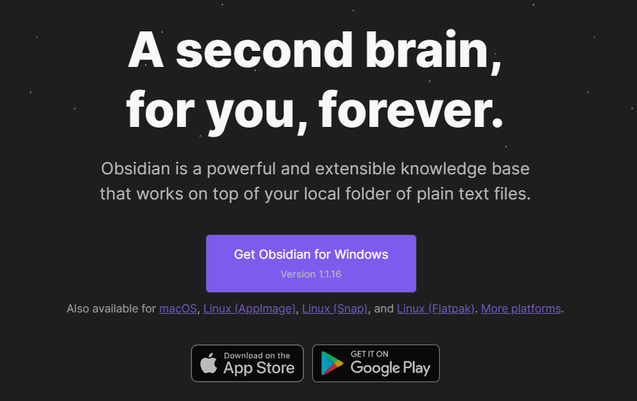
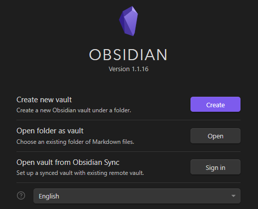
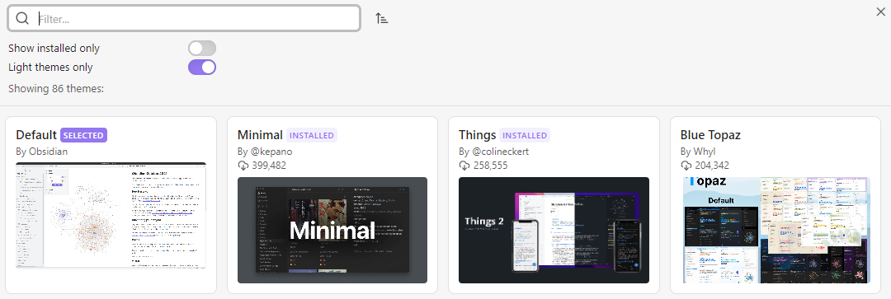

# Getting Started with Obsidian

## About Obsidian

[Obsidian](https://obsidian.md/) is a knowledge base, and a second brain. This platform works from a local folder of plain text files on your computer, called a *vault* and it allows you the ability to connect and customize your own collection of notes.

Using Obsidian should be a personal and unique experience. There are countless ways to make your vault perfect for you, and there's no wrong way to use it! The best way to figure out how to enhance your Obsidian experience is to just open it up and start writing. Along the way, you will find your own workflow with plugins that make writing your notes seemless. However, it is nice to see examples of some of the basic things you can do, and that's the purpose of this workshop.

## Download Obsidian

If you haven't already, please [download Obsidian](https://obsidian.md/). It is available for desktop on Windows, Mac, and Linux, and it's available for mobile devices.

## Create a Vault

Once you have Obisdian installed, open it and create your first vault!

There are several options to open a vault. For new users, it is recommended to create a new vault in an empty folder on your computer. There is also an option to open a vault from an existing folder of Markdown files.

### Create an new vault

Select the option to "*Create new vault*" and in the next window, give a name and location for your vault. This will create a folder of the same name in the chosen location on your computer.

### Open folder as vault

As you become more comfortable with Obsidian, you may have reasons to create and access multiple vaults. At any time you can open a vault from any existing folder. Obsidian recognizes many files types, but Markdown files are most versitale for editting and formatting.

### Sync your vault in the cloud

If you want to access your vaults across different devices, you have several options. If you prefer to store your files on a cloud-based storage platform like Google Drive or Dropbox, you can easily create a vault from a folder in those locations. Just make sure to sync any folder that contains a vault to your device.

## Customize Your Vault's Theme and Appearance

Obsidian is highly customizable! Now that you have a vault, you can make it look most appealing to your taste.

- Select the **Settings** option (gear icon) in the bottom left corner of the window
- Choose the **Appearance** tab
- Choose a **Base color scheme** between Light or Dark
- Choose an **Accent color**
- Finally, you can explore **Community Themes** by selecting **"Manage"** under **Theme.** There are tons of options for you to personalize your vault, but some community themes may drastically change your interface. We recommend that you wait to install community theme after reviewing this tutorial, so that visuals are consistent while you learn.

